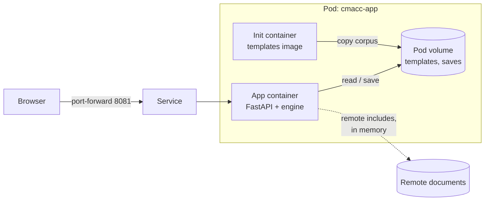

# CommonAccord renderer (Python)

- Python port of the legacy PHP/Perl renderer; same URLs (`i.php?v=…&f=…&k=…`)
- Acceptance: every template renders without error (no byte parity with Perl)
- Templates are not in this image; they ship as their own image

## How it runs



- Store location from settings; a local path today, object storage later by URL
- Saves land in the Pod volume; replacing the Pod restores the image's corpus

## Engine

- Legacy lookup rules: own line first, then includes by prefix; placeholders re-resolve from the root document
- Legacy truth rule kept: "" and "0" count as not found
- Added: missing include reported (response header, HTML comment), page still renders
- Added: loop guard plus budgets (nesting, lookups, text size); cuts counted, placeholder left unresolved
- One engine, output modes per view: document spans, plain, trace, xray
- No HTML in Python: page markup in Jinja templates; inline markup (value spans, brace highlighting, parameter suggestions) as macros in one macros template; Python passes data

## Views

| Code | View |
|---|---|
| `d` / `v` / `c` | Document / Visual (Cicero alias) |
| `p` | Print |
| `m` / `o` | Missing fields / Open parameters |
| `t` / `x` | Trace / Xray |
| `s` / `j` | Source / JSON-ish (both save) |
| `l` | Folder listing |

## Settings (`CMACC_*`)

| Variable | Default | Meaning |
|---|---|---|
| `CMACC_STORE` | `Doc` (image: `/data/Doc`) | template store path or fsspec URL |
| `CMACC_FILES` | `File` (image: `/data/File`) | supporting materials |
| `CMACC_STATIC` | `.` (image: `/app/static`) | icons and images |
| `CMACC_LANDING` | `S/About/Landing3.md` | landing template |
| `CMACC_REPO_URL` / `CMACC_REPO_BRANCH` | empty / `master` | GitHub and Compare links; hidden when empty |
| `CMACC_REMOTE_INCLUDES` / `CMACC_REMOTE_TIMEOUT` | `true` / `20` | remote include fetching |

## Tasks

```bash
task app:test     # unit tests (engine rules, loops, bytes, views, save)
task app:sweep    # every template, engine only; fails on any error or timeout
task app:lint     # Ruff: complexity, long functions, line length, simplifications, formatting
task app:dev      # build app + templates images, deploy together, forward 8081, pulse
CMACC_PORT=8081 task probe -- '/i.php?v=d&f=G/…&k=r00t' 'pattern'
```

- Dependencies: pinned with hashes in the lock files; regenerate with uv inside the pinned Python image
