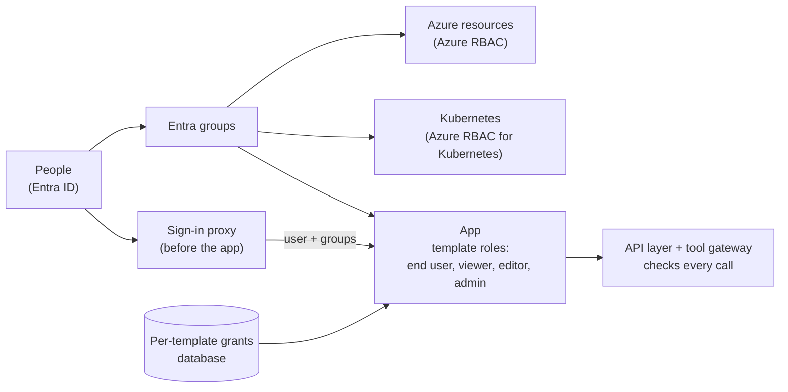
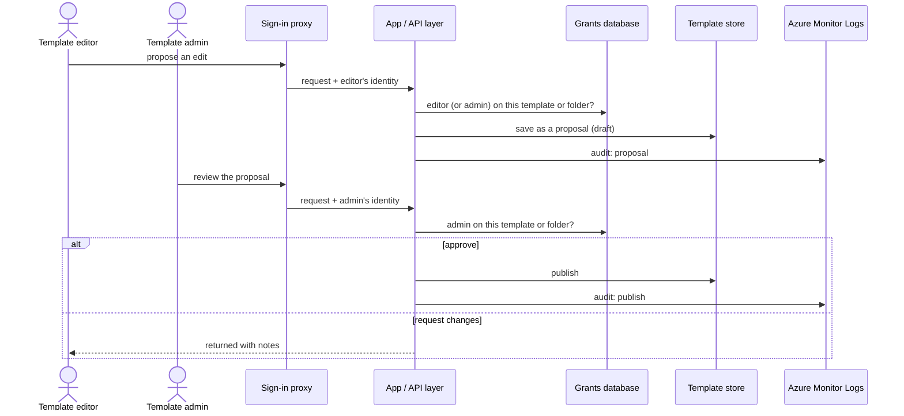
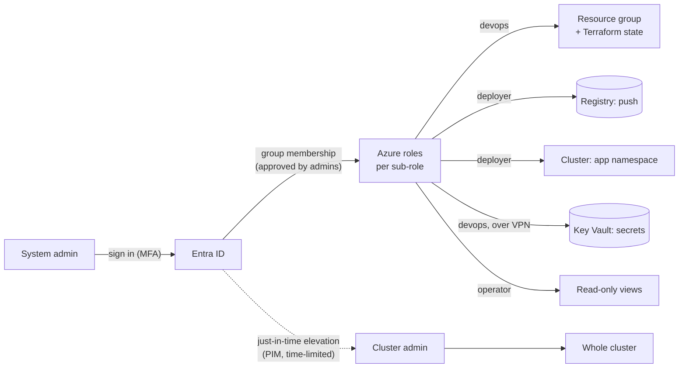
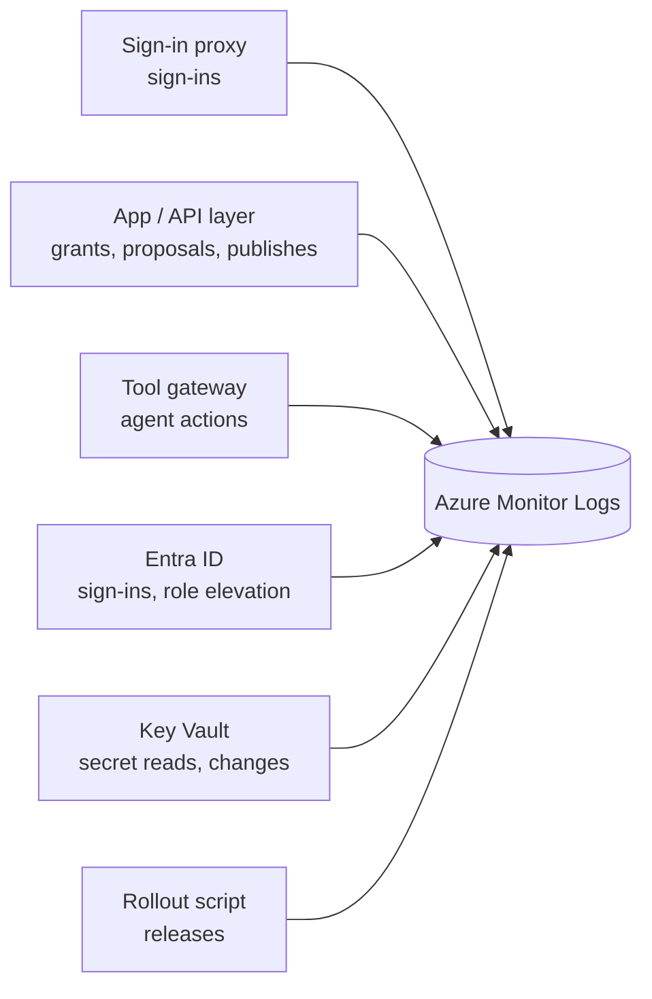
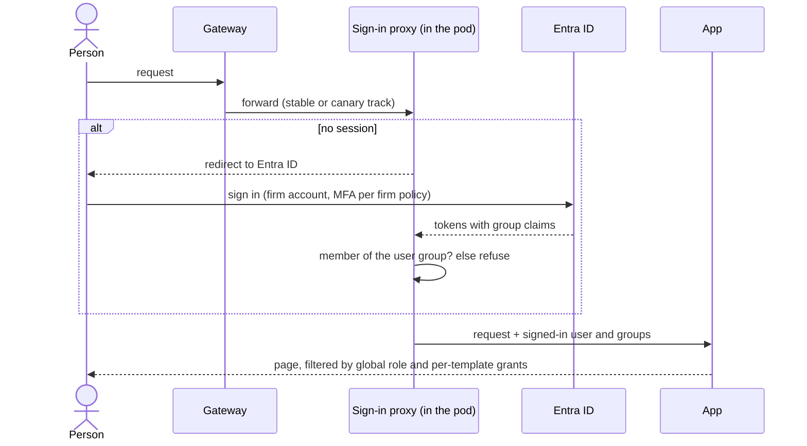

# Access control: roles, groups, and permissions

- Who can do what, for people; agents are covered in [agent-identities.md](agent-identities.md)
- All identities live in Microsoft Entra ID; nobody gets a local account
- Permissions come from group membership and per-template grants, never from individuals being named in code or config
- One installation per firm; the firm's people are granted accounts
- Signed-in only: no anonymous access to any page
- Sign-in happens before the app (Entra ID via a sign-in proxy); the app never handles passwords or tokens
- Status: proposal; open questions at the end

## Roles

| Role | Who | Can | Granted by |
|---|---|---|---|
| End user | members of the firm with an account | read published templates they may see; fill forms; use the chatbot | Entra group |
| Template viewer | per template or folder | read that template, including drafts and history | a template admin of that template, or a global template admin |
| Template editor | per template or folder | propose edits to drafts; cannot publish (templates are curated) | a template admin of that template, or a global template admin |
| Template admin (per template) | per template or folder | edit, review editors' proposals, publish; grant viewer/editor/admin on that template | a global template admin |
| Template admin (global) | legal users who manage the corpus | everything a per-template admin can, on all templates; assign per-template roles | Entra group |
| System admin | platform operators | run and change the platform; no template decisions | Entra group (sub-roles below) |

- Per-template roles apply to a template or a folder, and are inherited by everything under that folder
- Grants name Entra users or groups
- Template roles and system roles are separate: operating the platform does not grant template rights, and the reverse

## Where each permission is checked

- **Sign-in:** an Entra ID sign-in proxy (oauth2-proxy) runs beside the app in every pod
  - redirects to Entra ID, requires membership of the installation's user group, then passes the user and groups to the app
  - uses workload identity: no client secret stored anywhere
  - the app accepts identity only from its own proxy, never from the outside
  - one exception: a health route open without sign-in for liveness checks; page smoke tests sign in with a dedicated test account
- **App:** reads the signed-in user and groups from the proxy; the API layer checks the global role and the per-template grants on every request
- **Kubernetes:** AKS Automatic uses Entra ID with Azure RBAC for cluster access; no Kubernetes-local accounts
- **Azure resources:** Azure RBAC on the resource group, registry, and state storage

## Changing a template: who may do what

- Editors propose; template admins review and publish; every step is checked against the grants and audited

## System admin sub-roles

| Sub-role | Does | Azure roles (proposed, built-in) | Scope |
|---|---|---|---|
| Devops | runs Terraform; sets secret values (over VPN) | Contributor; Role Based Access Control Administrator (limited to the roles Terraform assigns); Storage Blob Data Contributor; Key Vault Secrets Officer | resource group; state storage container; key vault |
| Deployer | build and release | AcrPush; Azure Kubernetes Service Cluster User Role; Azure Kubernetes Service RBAC Writer | registry; cluster; app namespace only |
| Cluster admin | emergencies | Azure Kubernetes Service RBAC Cluster Admin | cluster; just-in-time only |
| Operator (read) | troubleshooting | Reader; Azure Kubernetes Service RBAC Reader | resource group; cluster |

- Devops includes the deployer sub-role today (one team); the split lets the future deploy cluster hold only deployer rights
- Cluster admin is time-limited elevation (Entra Privileged Identity Management), not standing membership
- The cluster's own identity only pulls images (AcrPull); it has no other rights

## Groups (proposed names)

- `cmacc-users`: end users; membership is required to sign in
- `cmacc-template-admins`: global template admins
- `cmacc-devops`, `cmacc-deployers`, `cmacc-operators`: system admin sub-roles
- `cmacc-cluster-admins`: eligible for just-in-time cluster admin
- Per-template grants reference these groups or individual users; they are rows in the app database, not groups
- Membership of every group is approved by admins (for now)

## Audit

- Recorded with who, what, when: sign-ins, per-template grants and removals, publishes, role elevation, deployments
- Stored in Azure Monitor Logs (the installation's Log Analytics workspace)
- System changes (Terraform, releases) are also recorded in the repository history

## Sign-in flow

## Open questions

- Save endpoints: the app does not check roles on saves yet, so any signed-in user could save; disable saves or enforce the editor and admin roles before users get access
- People in more than 200 groups: the proxy needs consent to read their full group list from Microsoft Graph
