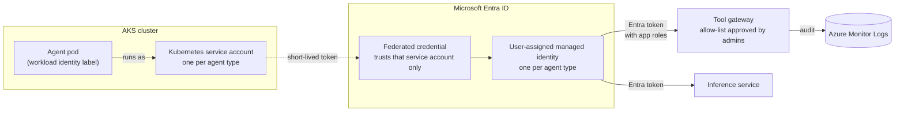
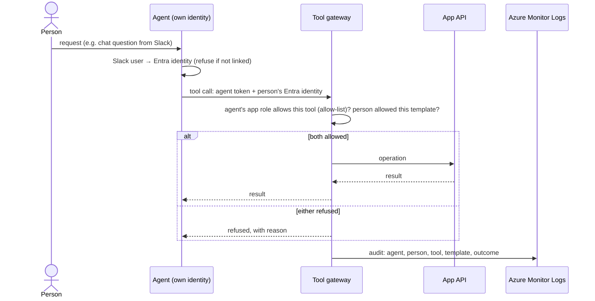

# Agent identities: service accounts for agents

- How agents running in the cluster prove who they are and what they may do
- Agents: ingestion agents (Temporal workers), n8n tool flows and the chatbot, future agents
- People and platform roles: [access-control.md](access-control.md)
- Status: proposal; open questions at the end

## Principles

- Every agent type has its own identity; no shared identities, no stored secrets
- Agents get the least they need: read and propose, never publish
- Agents reach templates only through the tool gateway, never storage directly
- When an agent acts for a person, both must be allowed: the agent's tools and the person's template rights
- Any agent can be switched off immediately by removing its credential
- Agents are authorized with Entra app roles; tools come from an allow-list that admins approve
- Every agent action is logged with the agent and, when acting for a person, that person's Entra identity
- Audit and agent logs go to Azure Monitor Logs

## How an agent gets an identity

- Azure side (Terraform): the managed identity, its federated credential (this cluster, this namespace, this service account), its role assignments
- Cluster side (deploy scripts): the service account with the identity's client ID, and the workload-identity label on the pod
- Tokens are short-lived and refreshed automatically; nothing to rotate by hand
- The service account has no rights inside Kubernetes itself

## Agent types (initial)

| Agent | Namespace / service account | May | May not |
|---|---|---|---|
| Ingestion agent | agents / ingestion | read and propose tools through the gateway; inference | publish; touch storage; call the Kubernetes API |
| n8n (tool flows, chatbot) | workflows / n8n | tools allowed for each flow; inference; its Slack and database secrets, synced from Key Vault ([secrets.md](secrets.md)) | publish; touch storage directly |
| Temporal server | workflows / temporal | its own workflow state | template content |
| App API (not an agent; listed for contrast) | app / cmacc-app | read published templates; write staging; publish with a recorded human approval | act without an authenticated caller |

## Acting for a person

- Chat users (e.g. Slack) must be linked to their Entra identity; unlinked users are refused
- The linked Entra identity is recorded with every action the agent takes for that user
- Agent-only work (e.g. ingestion with no person behind it) uses only the agent's own permissions
- Publishing always needs a person with the right template role; an agent can prepare, never approve

## Lifecycle

- **Add an agent type:** identity + federated credential + role assignments + Entra app roles (Terraform); service account (deploy scripts); tool allow-list entries approved by admins
- **Add a tool for an agent:** admins approve it onto the allow-list; until then the gateway refuses it
- **Change its permissions:** edit the role assignments or gateway allow-list; takes effect on the next token
- **Switch it off now:** delete its federated credential; new tokens are refused within minutes
- **Retire it:** remove the service account, identity, and allow-list entry
- Limit to plan around: 20 federated credentials per managed identity

## Open questions

- How a Slack user is linked to an Entra identity (Slack sign-in through Entra, or a verified mapping)
- How the person's identity travels with an agent call (token exchange on behalf of the person vs a signed user-context claim)
- Per-agent rate limits and quotas
- Log retention period
