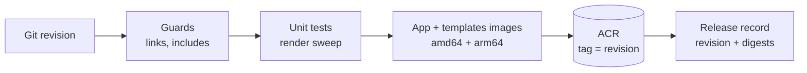
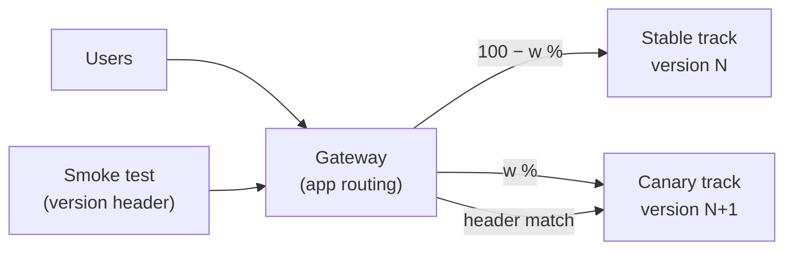
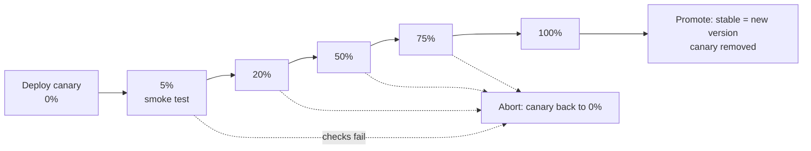

# Build and release

- How a change becomes images in the registry (build), and how users move onto it (release)
- Build and release are separate steps: building never changes what users see
- Infrastructure they run on: [infrastructure.md](infrastructure.md)

## Build

- Builds two images per revision:
  - app: the Python renderer
  - templates: the corpus only
- Every image is built for amd64 and arm64 (the cluster may start either kind of node)
- Pushed to the container registry (ACR); tag = git revision
- Deployments always reference the digest, never the tag
- Records a release: revision + app digest + templates digest, for the release step to use
- Checks before pushing: link and include guards, unit tests, render sweep

## Release: stable and canary tracks

- Two tracks run side by side, each a full copy of the app (sign-in proxy + app, templates copied in at start)
  - stable: the version users get today
  - canary: the version being rolled out, or the B side of an A/B experiment
- One gateway, one route; the route splits requests between the tracks by weight
- A header forces the canary regardless of weight, so smoke tests always reach it

## Stages

- 5% (smoke test), 20%, 50%, 75%, 100%, then promote
- Each stage moves on only when its checks pass

- Checks per stage: pulse against the canary (via the version header); at 5% also the page smoke test
- Every page is behind sign-in: liveness checks use a health route exempt from sign-in; page smoke tests sign in with a dedicated test account
- Checks retry before aborting (a spot eviction mid-stage looks like a failure; see the spot notes in the infrastructure document)
- Abort and promote are the same operation: change weights, then tidy up tracks

## A/B experiments

- Same mechanism: the canary track runs the B version; its weight sets the exposure
- Weights apply per request, not per user: one user can see both versions
  - fine for rollouts; experiments that need a consistent experience per user add a cookie match later

## Who runs it

- Build and release run from the devops machine for now
- The same scripts move to a deploy cluster later (unspecified); CI is chosen with the first deploy
- Permissions needed: push to the registry (build), change workloads and routes in the app namespace (release); see [access-control.md](access-control.md)
