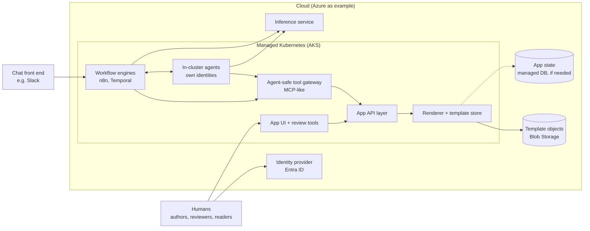
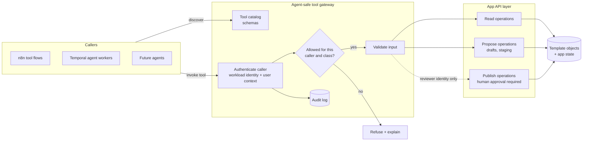
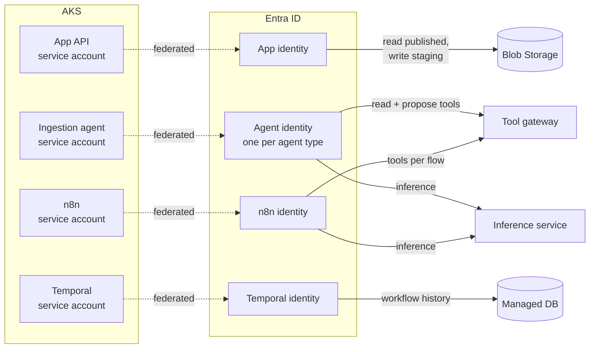
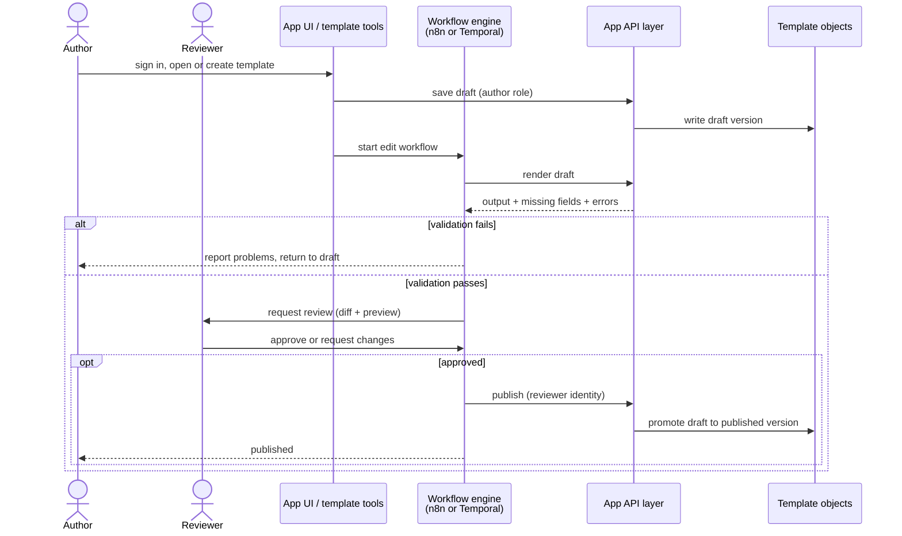
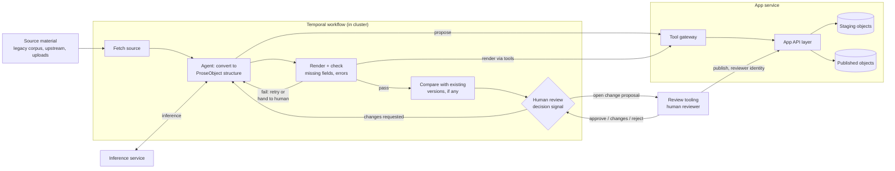
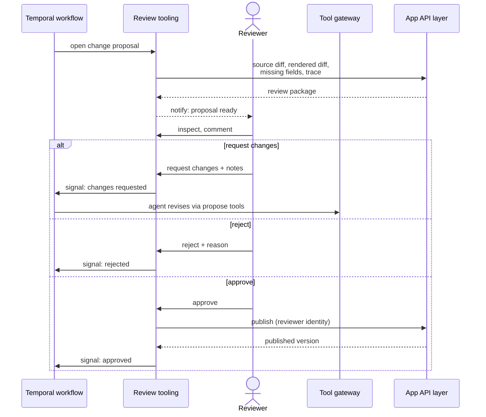
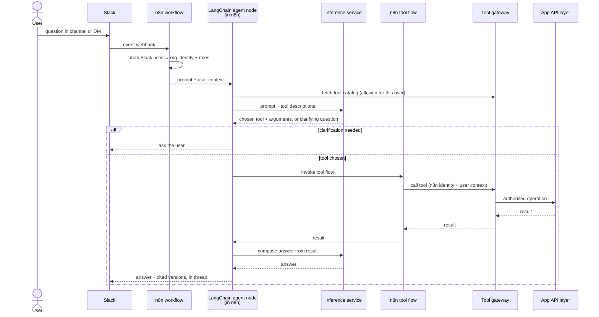
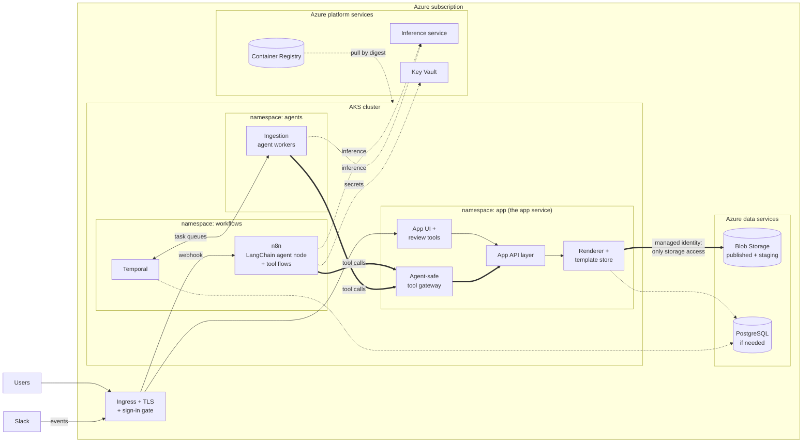
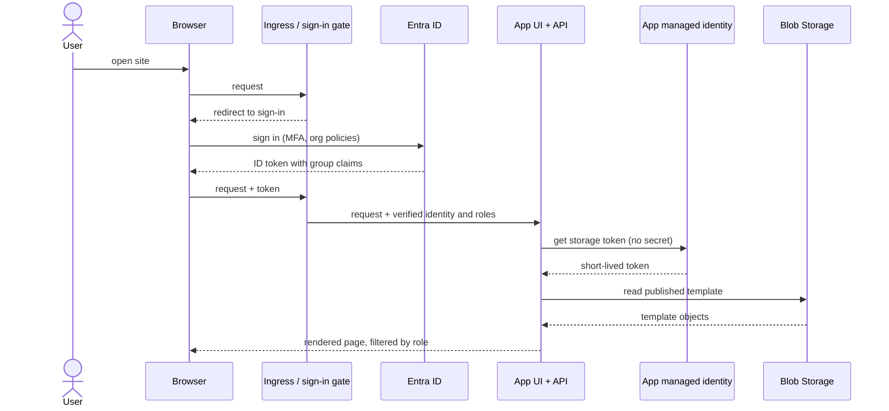
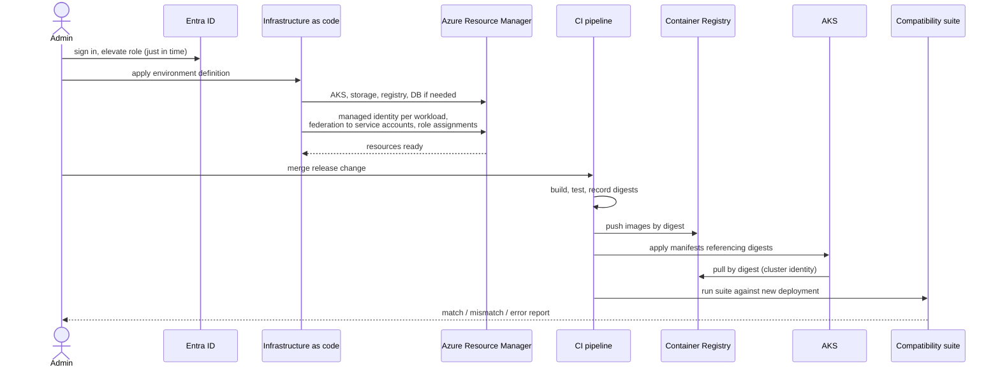

# Goal state

- Where the CommonAccord modernization is heading
- Azure used as the example cloud throughout; not a final provider decision
- Diagrams show intent, not a finished design; open decisions listed at the end

## Goal state summary

- App fully containerized, deployed to managed Kubernetes
- App state in a managed database, only if the architecture requires it
- Templates stored as cloud objects
  - not checked into the repo
  - not baked into images
- Template generation tools usable by humans and agents
  - write to cloud storage under role-based access control
- Agents run inside the cluster, each with its own managed identity and permissions
- One API layer on the app server, exposed to agents through agent-safe, MCP-like tool gateways
- Template editing workflows run on a workflow engine (n8n or Temporal), hosted in the same managed cluster
- Template ingestion always ends in a human review step, with tooling built for it
- Chatbot front end for inference-generated answers about templates and form states
  - backed by n8n
  - reuses existing tools; no reimplemented functions

## Tool API layer and agent-safe gateway

- One API layer: every app capability exposed once, used by UI, workflows, agents
- Gateway in front for all non-human callers; MCP-like
  - tool catalog: discoverable names, descriptions, input/output schemas
  - caller authenticated by its own identity; user context passed through when acting for a person
  - per-tool authorization from roles
  - input validation before anything reaches the app
  - side-effect classes: read, propose, publish
  - publish never available to agents; needs a human reviewer's identity
  - rate limits, timeouts, audit trail of every call
- Operations themselves not defined yet; this section fixes only the mechanism

## Workload identities and permissions

- Every in-cluster workload gets its own identity; no shared keys
- Azure example: Kubernetes service account → federated → its own user-assigned managed identity
- Permissions granted to identities, scoped as narrowly as each job needs
- Agents reach templates only through the gateway, never storage directly

| Workload | Identity | May | May not |
|---|---|---|---|
| App API | own | read published, write staging, publish with recorded human approval | act without an authenticated caller |
| Ingestion agents | one per agent type | read and propose tools, inference | publish, touch storage directly |
| n8n | own | tools allowed for each flow, inference | touch storage directly |
| Temporal | own | its own workflow state | template content |
| Humans | Entra sign-in | per group: read, author, review, publish | — |

## Template workflow: humans adding or editing

- Authors edit drafts; nothing reaches published templates without review
- Workflow engine owns the process state: draft → validated → approved → published
- Validation = render with the app, check for missing fields and parser errors
- Published templates are versioned objects; the app reads published versions only

## Template ingestion workflow: agents in Temporal

- Brings outside material into the corpus: existing corpus, upstream repos, contracts from users
- Temporal: durable, retryable steps; waits for the human decision as a signal
- Agents run as in-cluster Temporal workers under their own identities
  - call tools through the gateway: read, propose
  - write to staging only; cannot publish
- Every ingestion ends at human review

## Human review tooling

- Needed so ingestion (and agent-generated changes) can be judged by people
- Builds on ideas already in the CommonAccord material
  - plain-text objects so diff and code review work unchanged
  - access modeled as pull requests / push requests, governed by distribution lists
  - forking and convergence as the normal way templates improve
- A change proposal = pull-request-like package for one ingestion
  - source-level diff of the objects
  - rendered-text diff (same approach as the compatibility suite)
  - missing fields and parser errors
  - inheritance trace: which objects a rendered clause came from
  - provenance: source material, agent identity, model, prompts
- Decisions: approve, request changes (back to the agent loop), reject
- Every decision recorded with the reviewer's identity

## Chatbot workflow: Slack front end, logic in n8n

- Questions about templates ("what does this clause cover?") and form states ("what is still missing?")
- Tool choice made by a LangChain agent running in an n8n node
  - sees the gateway's tool catalog
  - picks the tool (or asks a clarifying question) from the human prompt
- Chosen tool runs as its own n8n tool flow, which calls the gateway
- No logic reimplemented in n8n; all capabilities come from the app's tools
- Answers limited to what the asking user may read; cite the versions used

## App server on AKS, templates as cloud objects

- App pods hold no templates; they read published objects from Blob Storage
- API layer is the only component with storage access
- n8n and agents reach capabilities through the gateway, never storage directly
- Every workload authenticates with its own managed identity; no stored secrets
- Managed DB only if app state (e.g. form states, sessions) needs it

## Human user sign-in (Azure example)

- People sign in with Entra ID (OIDC), with organization policies such as MFA applied there
- Managed identities cover the workloads: the app uses its own identity to reach storage
- The app never holds user passwords or storage keys
- Roles from Entra groups decide read, author, review, publish

## Admin deploying the system (Azure example)

- Admin elevates just in time; no standing owner rights
- Infrastructure as code creates cloud resources, identities, and role assignments; tool not chosen yet
- CI builds and validates images, pushes by digest
- Cluster changes applied from the repository (e.g. GitOps), not by hand
- Compatibility suite runs against the new deployment before traffic moves

## Milestones

- Labels only; order and dependencies not decided

| Milestone | Outcome | Status |
|---|---|---|
| M1 Legacy on local Kubernetes | Pinned legacy image, corpus baked in, on local Kubernetes; developer tasks | Done |
| M2 Compatibility suite | Black-box tests outside the app; any renderer vs any renderer | Prototype: one case, tool + unit tests; public baseline blocked by site outage |
| M3 Deployment portability | Same image runs locally and on managed Kubernetes | Partial: probes, security context, limits, digest pinning; draft managed-cluster notes |
| M4 Template storage abstraction | Filesystem (compatibility) and object storage backends | Not started |
| M5 Python implementation | Python renderer; every template renders without error (parity not required); Perl stays in the legacy image | Design done |
| M6 Managed Kubernetes + identity | Managed cluster via infrastructure as code; human sign-in; per-workload managed identities | Not started |
| M7 Templates cloud-only | Corpus in object storage with versions and roles; out of images and repo | Not started; needs explicit approval |
| M8 Workflow engines | Human edit workflow; agent ingestion in Temporal; in-cluster agents | Not started |
| M9 Chatbot | Slack (example) → n8n → LangChain tool choice → tool flows | Not started |
| M10 API layer + tool gateway | One app API; agent-safe MCP-like gateway with catalog, authorization, audit | Not started |
| M11 Review tooling | Change proposals with source/rendered diffs, trace, provenance, decisions | Not started |

## Constraints

- Legacy PHP/Perl app and corpus remain the reference until the suite shows parity
- Removing templates from the repo and images changes the project's current contract
  - needs explicit approval at that point
  - filesystem backend stays as the compatibility option until then
- Current save endpoints write to the corpus; replaced by reviewed workflows before public exposure
- Agents never publish; a human decision is always recorded
- Nothing here requires installing PHP or Perl on a workstation

## Open decisions

- Cloud provider (Azure is the example)
- Workflow engine for human edit workflows: n8n or Temporal
- Whether app state needs a database, and which state
- Infrastructure-as-code tool; GitOps or pipeline-driven deploys
- Inference provider and model
- Gateway protocol: MCP itself or MCP-like
- Tool catalog: operations, schemas, side-effect classes per tool
- How chat identities map to org identities
- Review tooling form: part of the app UI, separate tool, or both
- Template versioning and object layout
- Role model: who can author, review, publish; agent limits
- Public read access vs signed-in only
- Chat front ends beyond Slack
