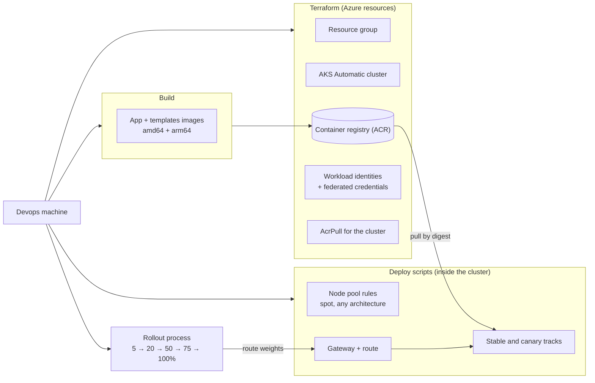

# Infrastructure: AKS on Azure

- Target infrastructure for the first managed deployment (M6)
- Priorities: cheapest possible, not performance; simple to operate
- Runs on AKS Automatic, with AKS application routing (Gateway API implementation) for ingress
- Compute: the cheapest capacity available, flexible across VM sizes and CPU architectures
- Releases roll out in stages: 5% (smoke test), 20%, 50%, 75%, 100%
- Terraform runs from the devops machine for now; a deploy cluster later (unspecified)
- No public endpoints where avoidable: admins reach private resources over VPN; Slack connects outbound (Socket Mode)

## Who owns what

- **Terraform:** Azure resources only (cluster, registry, identities, role assignments)
- **Build:** images for the app and the templates, pushed to the registry
- **Deploy scripts:** everything inside the cluster (node pools, gateway, workloads)
- **Rollout process:** separate from the build; moves traffic between versions in stages

## Terraform scope

- Resource group
- AKS Automatic cluster (dedicated AzureRM resource; Kubernetes 1.36)
  - comes with: workload identity, OIDC issuer, managed system nodes, node auto-provisioning, Gateway API app routing (1.36+), Entra ID sign-in for cluster access
- Container registry, Basic tier (cheapest), admin account off
- AcrPull role on the registry for the cluster's kubelet identity
- One user-assigned identity per workload, with its federated credential and role assignments (start: the sign-in proxy; add others as workloads need Azure access)
- Entra ID app registration for sign-in, with a federated credential for the sign-in proxy (managed with the Entra ID Terraform provider)
- Managed PostgreSQL (flexible server, smallest burstable size) with one database for app state (per-template grants)
  - reachable only from inside the cluster: private network access, no public endpoint
- Virtual network for the cluster and the database, with a private DNS zone for the database (a private database requires AKS Automatic in a custom network)
- Log Analytics workspace (Azure Monitor Logs) for audit and agent logs
- Azure Key Vault: source of truth for tokens and secrets; private endpoint only; values set outside Terraform ([secrets.md](secrets.md))
- Point-to-site VPN (Azure VPN Gateway, Entra ID sign-in) for admin access to private resources such as the vault
- Azure resource providers registered explicitly (AzureRM 5 no longer registers them)
- State: remote, in an Azure Storage account created once before the first apply
- Not in Terraform: images, containers, node pool rules, gateway, routes, the secret sync job (all installed by deploy scripts)

## Compute: cheapest, flexible

- Automatic's system nodes are Microsoft-hosted and not billed to the subscription
- Workload nodes come from node auto-provisioning; the default pool (on-demand, amd64, D-series) is replaced by a cheaper pool:
  - spot first, on-demand when spot is unavailable
  - amd64 or arm64, whichever is cheaper
  - small general-purpose sizes only, with a total CPU cap so costs cannot run away
- Needs multi-architecture images: every image is built for amd64 and arm64
- Spot trade-offs: see "Spot: planning notes" below

## Related documents

- Build, registry, and staged rollouts: [build-and-release.md](build-and-release.md)
- Roles and access: [access-control.md](access-control.md); agent identities: [agent-identities.md](agent-identities.md)
- Tokens and secrets: [secrets.md](secrets.md)

## Costs to expect

- AKS Automatic management fee (not shown on the public pricing page; check the Azure pricing calculator for the chosen region)
- Workload VMs: spot pricing, small sizes, capped
- Container registry: Basic tier
- Public load balancer and IP for the gateway
- PostgreSQL: smallest burstable size
- Monitoring: Log Analytics for audit and agent logs (billed per GB ingested; retention to be set); nothing else extra until needed
- Outbound traffic: the managed NAT gateway AKS Automatic preconfigures (hourly + per GB)
- VPN gateway for admin access (hourly, by gateway size)
- Private endpoint for the vault (hourly + per GB)
- Key Vault: per operation (mostly the sync job's reads)

## Billing questions

- AKS Automatic management fee in the chosen region (not on the public pricing page)
- Smallest VPN gateway size that supports point-to-site with Entra ID sign-in, and its monthly cost
- Managed NAT gateway: fixed monthly cost vs outbound data; is a cheaper outbound option acceptable
- Log Analytics: expected GB per month (Container Insights defaults can be large), retention period, daily cap
- PostgreSQL: size, storage, and backup retention
- Spot capacity: CPU cap level, and how much on-demand fallback is acceptable
- Public IP and load balancer for the gateway, if users reach the app publicly (see open items)
- Who pays: one subscription per firm installation, or shared; how costs are tagged per installation
- Budgets and alerts per installation
- Commitment discounts (savings plan or reservations) once usage is known

## Spot: planning notes

- Azure can evict spot VMs at any time, with about 30 seconds' notice
  - pods on the evicted node stop; the site (or one track) pauses until a replacement node starts
  - a pod disruption budget does not prevent spot eviction
- One replica per track means no overlap during an eviction
- The gateway's proxy pods run on workload nodes too; an eviction there interrupts all traffic, not one track
- On-demand fallback covers spot shortages, not evictions already in progress
- Spot prices and availability vary by region and VM size; the CPU cap limits cost, not availability
- Each restart copies the templates image again and discards saves (already disposable)
- Rollouts: a canary evicted mid-stage looks like a failure; stage checks should retry before aborting
- Options if interruptions become a problem, in order of cost:
  - two replicas per track, spread across nodes
  - keep the gateway on a small on-demand pool
  - keep the stable track on on-demand; canary stays on spot

## Carried over from local

- Same images and settings as local; only the registry and pull policy differ
- Templates image copied into a Pod volume at start (M4); saves are disposable and per track
- Each pod: sign-in proxy + app, with the templates copied in at start
- Inside the cluster, a network policy lets only the app's pods reach the database
- Secrets arrive through a sync job from the vault (External Secrets Operator), per namespace
- Pulse and render sweep work against any base URL

## Open items

- Region
- How firm users reach the app: public gateway (signed-in only) or private, over VPN
- Hostname, DNS, and TLS for the gateway
- Storage account for Terraform state (who creates it, naming)
- Which Entra tenant each firm installation uses, and who owns its app registration
- Deploy cluster for future rollouts (unspecified)
- CI platform (with the first deploy)
