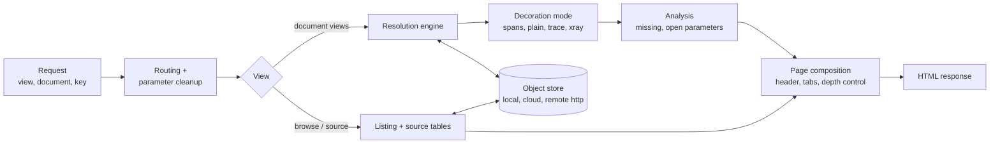
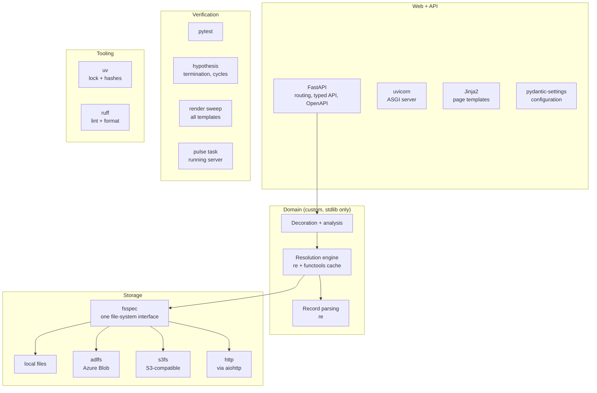
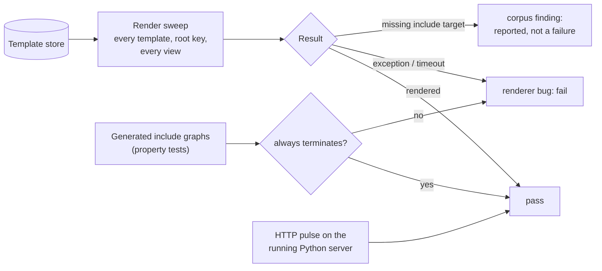
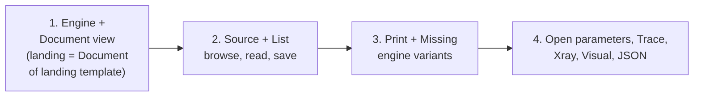

# Python port: problem breakdown and libraries

- Goal: Python renderer at parity with the legacy PHP/Perl app
- Principle: libraries wherever possible; custom code only where no library fits
- Only open-source libraries that are currently active and widely adopted
- Status: implemented (M5); see the app README for how it runs
- Deviations from this design, decided during implementation:
  - python-multipart dropped: form parsing via the standard library
  - aiohttp / fsspec http dropped: remote includes via the standard library, in memory, with a timeout
  - budgets added (nesting 1,000; lookups 1M; text 5M chars): one runaway template in the corpus is cut, nothing else
  - `CSS.Special` treated as a stylesheet in every view (its only use in the corpus)

## The problem

- Input: a store of plain-text ProseObjects (about 5,200 `.md` objects, plus HTML, images, CSS)
- Request: view + document + key (e.g. Document view, SAFE demo, `r00t`)
- Output: HTML page; the document is assembled by recursive, lazy key resolution
- Semantics: follow what the corpus relies on (Perl behavior) where it differs from the written spec
  - the spec describes whole-namespace construction
  - Perl resolves one key at a time, on demand
- Acceptance: every template renders without error (not byte parity)

## Functional parts

| # | Part | What it does | Legacy size |
|---|---|---|---|
| 1 | Routing | view/document/key params, defaults, path cleanup, view aliases | small |
| 2 | Object store | read objects, list folders, write saves, fetch remote includes | spread across all |
| 3 | Record parsing | line → key/value on the first `=`; inclusion lines `prefix=[target]` | a few regexes |
| 4 | Resolution engine | lazy key lookup, prefixed inheritance, placeholder expansion from the root document | ~60 lines Perl |
| 5 | Decoration modes | depth-tagged spans (Document), plain (Print), titled spans (Trace), Xray, header CSS lookup | 7 near-copies of the parser |
| 6 | Analysis | unresolved placeholders (Missing); suggested parameters with naming rules (Open parameters); visited-include table (Trace) | small |
| 7 | Page composition | header, tabs, depth-control script, missing-field highlighting, render date, "Nothing to Show" | medium, mostly static |
| 8 | Browsing | folder listing (+ intro/README), source key/value table with links, JSON-ish view | medium |
| 9 | Editing | save edited source (line endings, trim) | small |
| 10 | Static assets | CSS, images, scripts | none (web server) |
| 11 | Verification | every template renders without error; termination | test tooling |

- Seven Perl parsers share one engine → one Python engine with a decoration hook
- Views differ only in decoration and post-processing

## Library choice per part

| Part | Choice | Why | Custom code left |
|---|---|---|---|
| 1 Routing | FastAPI | typed params, same URLs, OpenAPI schemas reused later by the tool gateway | route table |
| 2 Store | fsspec (+ adlfs, s3fs, http) | one interface for local, Azure Blob, S3, and remote includes; covers the storage-abstraction goal | store root config |
| 3 Parsing | stdlib `re` | three regexes; a parser library adds nothing | ~20 lines |
| 4 Engine | stdlib (`re`, `functools`) | no library implements ProseObject resolution; it is the domain | ~80 lines |
| 5–6 Modes | stdlib | a hook on the engine instead of seven copies | ~60 lines |
| 7–8 Pages | Jinja2 | standard templating, autoescape control (values contain intended HTML) | templates |
| Config | pydantic-settings | env-based settings: store backend, root, remote-include policy | one settings class |
| Server | uvicorn | standard ASGI server | none |
| 11 Tests | pytest, hypothesis | render sweep over every template; generated inputs for cycle/termination | test cases |
| Tooling | uv, ruff | pinned lock with hashes (project pinning rule); lint/format | config |

## Candidates checked (2026-09-22)

| Library | Latest | Released | Python | GitHub stars / last push | Verdict |
|---|---|---|---|---|---|
| FastAPI | 0.141.1 | 2026-07 | ≥3.10, 3.14 listed | 102k / 2026-09 | use |
| Starlette | 1.6.0 | 2026-08 | ≥3.10, 3.14 listed | 12.6k / 2026-09 | use (via FastAPI) |
| uvicorn | 0.53.0 | 2026-09 | ≥3.10, 3.14 listed | 11k / 2026-09 | use |
| pydantic | 2.13.5 | 2026-08 | 3.14 listed | 28.8k / 2026-09 | use (via FastAPI) |
| pydantic-settings | 2.15.0 | 2026-08 | 3.14 listed | 1.5k / 2026-09 | use |
| Jinja2 | 3.1.6 | 2025-03 | ≥3.7, no classifiers | 11.8k / 2025-06; issues active 2026-09 | use: stable, heavily used |
| fsspec | 2026.9.0 | 2026-09 | 3.14 listed | 1.4k / 2026-09 | use; core of pandas/dask/xarray I/O |
| adlfs | 2026.8.0 | 2026-08 | 3.14 listed | 0.2k / 2026-08 | use for Azure |
| s3fs | 2026.9.0 | 2026-09 | 3.14 listed | 1k / 2026-09 | use for S3-compatible / local emulators |
| aiohttp | 3.14.3 | 2026-07 | 3.14 listed | 16.6k / 2026-09 | use (fsspec http) |
| pytest | 9.1.1 | 2026-06 | 3.14 listed | 14.5k / 2026-09 | use |
| hypothesis | 6.168.0 | 2026-09 | 3.14 listed | 9k / 2026-09 | use |
| syrupy | 6.1.1 | 2026-09 | 3.14 listed | 0.9k / 2026-09 | dropped: no parity snapshots needed |
| uv | 0.12.17 | 2026-09 | — | 90k / 2026-09 | use |
| ruff | 0.16.8 | 2026-09 | — | 50k / 2026-09 | use |
| httpx | 0.28.1 | 2024-12 | classifiers to 3.12 | 15.5k / 2026-03 | reject: no release in ~2 years |
| Flask | 3.1.3 | 2026-02 | ≥3.9 | 75k / 2026-09 | reject: no typed API/OpenAPI for the gateway |
| obstore | 0.11.1 | 2026-08 | ≥3.10 | 0.8k / 2026-09 | reject for now: pre-1.0, smaller adoption |
| fastapi-mcp | 0.4.0 | 2025-07 | classifiers to 3.12 | 12k / 2025-11 | reject: stale |
| mcp (official SDK) | 2.2.0 | 2026-09 | 3.14 listed | 24k / 2026-09 | later: tool gateway |
| fastmcp | 4.0.5 | 2026-09 | classifiers to 3.13 | 28k / 2026-09 | later, only if 3.14 confirmed |

## Version restrictions

- Runtime: Python 3.14 (same pinned image family as the renderer tests)
  - all chosen libraries declare 3.14, except Jinja2 / MarkupSafe (no classifiers; verify in tests)
  - fastmcp does not list 3.14 → prefer the official MCP SDK for the gateway
- FastAPI is 0.x: minor releases can break → pin exact versions via the lock
- FastAPI accepts Starlette ≥0.46; the MCP SDK on 3.14 needs Starlette ≥0.48 → lock one Starlette that satisfies both
- adlfs caps azure-core below 2.0
- fsspec, s3fs, adlfs, gcsfs release together (calendar versions) → upgrade as a set
- pydantic v2 only; no v1 compatibility layer
- Dependencies installed from the lock with hashes, inside the image build; nothing on the host

## Requirement: every template renders without error

- Only acceptance requirement; no byte-for-byte parity with Perl
  - public reference service unreachable, so parity cannot be checked anyway
- "Without error" = the renderer never
  - raises an exception or times out
  - loops forever on cyclic includes or placeholders
  - drops the page for a bad include; a missing target is reported, rendering continues
- Corpus defects (a template pointing at a file that does not exist) are reported as corpus findings, not renderer failures
- No hardcoded host: generated links stay relative (`i.php?…`) so pages work wherever deployed

## Behaviors the renderer must handle

- 4 objects are not UTF-8 → read as bytes, pass through unchanged
- 3 files use CRLF line endings
- Cyclic includes and self-referencing placeholders → guard, emit the placeholder unresolved
- Store paths are case-sensitive on Linux and object storage
  - corpus references now match real paths exactly; a pre-build check keeps it that way
- Missing include targets: 114 templates still reference content not in the store (older sibling repos, deleted example parties)
  - report and keep rendering; these templates must still render
- Include loops: at least one template loops forever in the legacy parser (misreported as a missing file); 15 templates hit a 20-second limit
- Remote includes (18 objects use `http` targets) → fetched with a timeout; failure = missing include, page still renders
- Keep the legacy semantics authors rely on: first matching line wins, prefixed inheritance, placeholders re-resolve from the root document with the accumulated prefix
- Save endpoints kept: source and JSON views write through the store (line endings normalized, trimmed)

## Verification

- Render sweep over the whole store, every view: pytest
- Termination under arbitrary include graphs: hypothesis
- Running server: existing pulse task pointed at the Python service
- Legacy Perl image stays available for manual side-by-side checks; not a gate

## Porting order

- Each step ships when every template renders without error in that step's views
- Step 1: the core
  - resolution engine, depth-tagged spans, missing-field highlighting, render date
  - landing page = Document view of the configured landing template; no separate code
- Step 2: makes the site usable end to end
  - List: folders, intro pages, README
  - Source: key/value table with links; carries the save endpoint
- Step 3: small variations on the engine (plain output; list of unresolved fields)
- Step 4: analysis and alternate views, lowest use
- Not ported: explore and graph pages (unreachable from the router)

## Carry-overs from the hardcode audit

- One settings object (environment, `CMACC_` prefix) for everything deployment-specific
  - template store location (local path or object-storage URL); no working-directory assumption
  - remote-include policy and timeout
  - repo URL and branch for GitHub / Compare links, same names as the legacy app; links hidden when unset
  - landing template
- Remote includes fetched in memory; no temp files in the store, no shell commands
- Loop guard on includes and placeholders; emit the placeholder unresolved
- Missing include = reported, rest of the page renders (fixes the remaining 114 without corpus changes)
- Case-sensitive store access; no case-folding fallbacks
- Browser assets (CSS, scripts) served locally from pinned copies, not public CDNs
- Relative links only in generated pages, so the app works under any host or subdirectory
- Image builds for any architecture, reusing the platform-from-engine build behavior
- Existing corpus checks (no legacy-host or root-relative links; exact include paths) keep running before every build, whichever renderer ships

## Size estimate

- Custom Python: roughly 300–400 lines (engine, modes, routes) plus templates
- Legacy equivalent: about 2,500 lines across PHP views and seven parser copies

## Decisions (2026-09-22)

- Jinja2: kept
  - still heavily used (companion library MarkupSafe ≈ 600M downloads a month; issue tracker active this week)
  - saves a moderate amount, not a large one: shared page layout, loops, and autoescaping, roughly 90 template lines vs roughly 130–160 lines of hand-built HTML strings
  - no active alternative is smaller
- Parity: not required; render-without-error is the bar
- Save endpoints: included in the port
- Remote includes: open fetching, with timeout and graceful failure

## Open decisions

- Remaining missing include targets: recover content from older repos, or leave as reported gaps
- Remote-include policy: open fetching vs an allow-list
