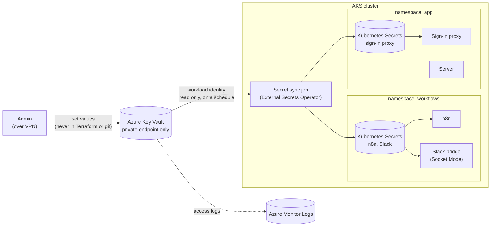
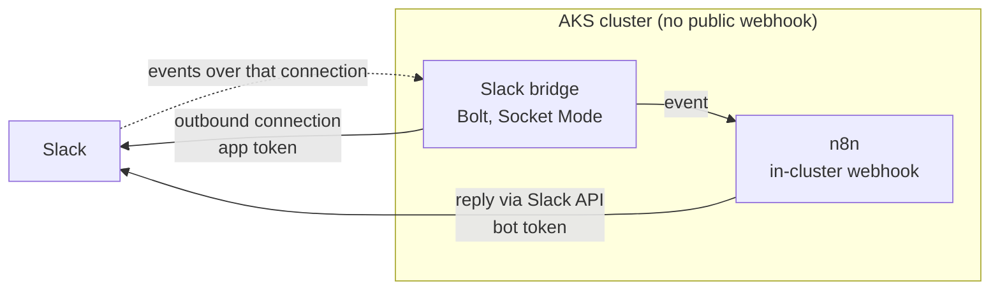

# Secrets: Azure Key Vault

- One Azure Key Vault per installation is the source of truth for the system's tokens and secrets
- A sync job copies the secrets each workload needs from the vault into the cluster
- Managed identities first: where Azure accepts an identity instead of a secret, there is no secret to store
- No public endpoints where avoidable: the vault is private, admins reach it over VPN, Slack uses Socket Mode
- Status: proposal; open questions at the end

## What is stored

| Secret | Used by | Purpose | Set by | Rotation |
|---|---|---|---|---|
| `pg-n8n-password` | n8n | n8n's login to its own database | devops | on demand; restart n8n |
| `n8n-encryption-key` | n8n | encrypts the credentials n8n stores | devops, once | rarely: n8n must re-encrypt its stored credentials |
| `slack-app-token` | Slack bridge | opens the Socket Mode connection to Slack | Slack admin, via devops | when regenerated in Slack |
| `slack-bot-token` | n8n | posts replies and reads Slack data as the app | Slack admin, via devops | when regenerated in Slack |
| `oauth2-proxy-cookie-secret` | sign-in proxy | signs the sign-in session cookie | devops (random value) | on demand; users sign in again |
| `smoke-test-password` | rollout checks | page smoke tests sign in as the test account | devops | periodic |

Not stored, because an identity is used instead:

- Server → database: Entra ID sign-in with the app's workload identity (short-lived token as the password)
- Sign-in proxy → Entra ID: workload identity federation, no client secret
- Agents and n8n → inference service, tool gateway: their own managed identities
- Cluster → container registry: the cluster's kubelet identity (AcrPull)

## The sync job: vault to cluster

- **External Secrets Operator** runs in the cluster as the sync job
  - reads the vault with its own workload identity, over the vault's private endpoint
  - writes each namespace only the secrets that namespace needs
  - refreshes on a schedule; a changed value in the vault reaches the cluster on the next refresh
- The vault stays the source of truth; nobody edits the Kubernetes copies
- Workloads read their Kubernetes Secrets as usual (n8n as files through its `*_FILE` variables)
- Services that read secrets only at start are restarted after a change
- The copies are protected by namespace permissions: a workload can read only its own namespace's secrets

## Admin access: VPN only

- The vault has no public endpoint; it is reachable only on the installation's private network
- Admins connect with a point-to-site VPN (Azure VPN Gateway, signing in with Entra ID), then use the vault as usual
- Setting or changing a secret value is always done over the VPN, by devops
- The sync job reaches the vault from inside the same network; it needs no VPN

## Database connections

- **Server:** signs in to PostgreSQL with Entra ID as its workload identity; the database role maps to that identity; nothing stored
- **n8n:** has no Entra sign-in for its database; uses its own database user with a password from the vault
- Each service has its own database and user; neither can read the other's data
- The database is reachable only from inside the cluster (private network, network policy); a stolen password alone cannot reach it

## n8n and Slack: Socket Mode

- Slack events arrive over Socket Mode: an outbound connection from the cluster to Slack, so there is no public webhook
- n8n's built-in Slack trigger supports only webhooks, so a small Slack bridge holds the Socket Mode connection
  - built on Slack's official Bolt SDK (Python)
  - forwards each event to an n8n webhook that is reachable only inside the cluster
- n8n replies through Slack's API with the bot token (also outbound)
- Slack users are tied to their Entra identities before any agent action (see the agent identities document)

## Who can do what

| Who | Vault role (Azure built-in) | Scope |
|---|---|---|
| Secret sync job (its workload identity) | Key Vault Secrets User | the secrets it syncs |
| Devops | Key Vault Secrets Officer | the vault (over VPN) |
| Everyone else | none | — |

- Workloads never read the vault directly; only the sync job does
- Vault uses Azure RBAC for access (not legacy access policies)
- Soft delete and purge protection on: a deleted secret can be recovered, and the vault cannot be purged by mistake
- Every read and change is logged to Azure Monitor Logs

## Terraform boundary

- Terraform creates the vault, its private endpoint and DNS, logging, the VPN gateway, and role assignments
- The sync job and its per-namespace secret mappings are installed by the deploy scripts
- Secret values are never in Terraform, its state, or the repository
- Devops set values with a script, over the VPN (from the devops machine now, from the deploy cluster later)

## Open questions

- Sync refresh interval (faster rotation vs more vault reads)
- Extra encryption of the cluster's copies with a Key Vault key (etcd KMS encryption)
- Temporal's database login, when Temporal is added (likely like n8n)
