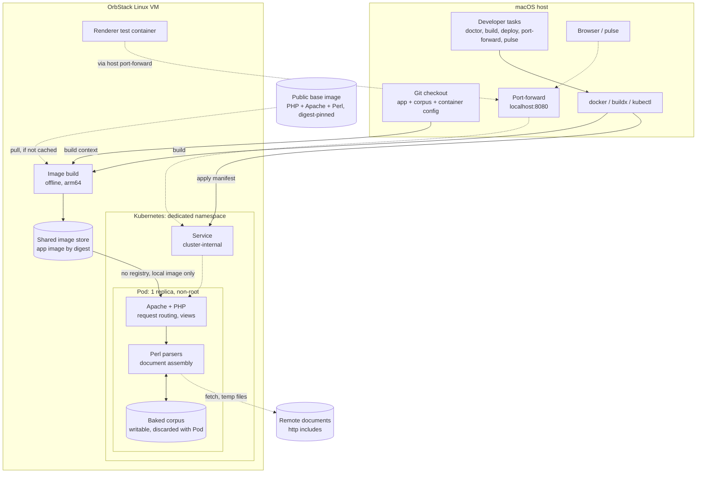
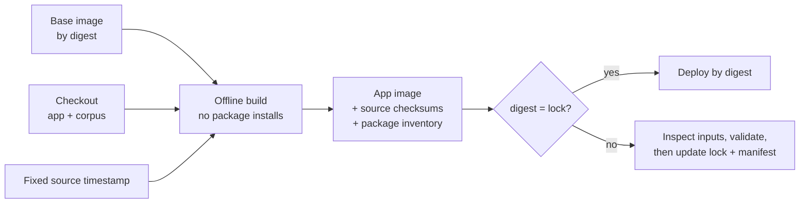
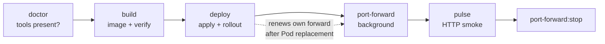

# Legacy container and local Kubernetes

- Legacy PHP/Perl app + document corpus + static assets in one image
- Nothing cloned or downloaded at startup
- PHP and Perl only inside containers; never on macOS
- Legacy application and deploy workflows unchanged, except approved fixes:
  - corpus links made relative (no hardcoded public host)
  - developer-specific editor link removed from the tab bar

## Local development environment

- Host: checkout, CLIs, browser
- OrbStack Linux VM: image build, image store, Kubernetes, test containers
- Solid arrows: build/deploy path. Dotted arrows: request traffic



- Build reads the checkout only; build context limited to app, corpus, container config
- Pod starts from the digest in the shared store; no registry
- Saves and remote-include temp files live only in the running container

## Pinning and reproducibility



- Lock file records:
  - base image digests (per platform) and key package versions
  - app image digest, source revision, timestamp
  - source and package inventory hashes
  - tested host toolchain
- Base image already has PHP 8.4.25, Apache, Perl, curl, CA certificates
- No package installs; no external build frontend
- Tag = convenience handle; deployment always uses the digest
- Byte-identical rebuilds not assumed across builders; verify the digest
- Remote documents and browser asset URLs: unchanged, not pinned

Tested host baseline:

| Tool | Version |
|---|---|
| OrbStack | 2.2.3 (2020300) |
| Docker / Buildx / BuildKit | 29.4.0 / 0.33.0 / 0.29.0 |
| kubectl / Kubernetes | 1.34.2 / 1.35.6+orb1 |

- Host tools operator-managed
- Changing baseline or digest = deliberate upgrade + validation

## Runtime

- Repo links (GitHub, Compare) from `CMACC_REPO_URL` / `CMACC_REPO_BRANCH`; hidden when unset
- Non-root (UID/GID 33), port 8080
- Apache front controller is the directory index
- PHP diagnostics to stderr; short tags on
- Corpus writable in the container:
  - legacy saves overwrite documents
  - remote includes create temp files
- No host mounts, no volumes
- Pod replacement restores baked content, discards edits
  - keep work you want in the host checkout

## Developer tasks

- Requires go-task (`brew install go-task`)
- Task scripts excluded from the build context; no effect on the digest



```bash
task doctor              # host tools; prints install/fix commands
task lint-links          # fail on legacy-host or root-relative links in deployed content
task lint-includes       # fail on include targets that only work on case-insensitive disks
task build               # pinned build, config test, checksums, digest vs lock
task deploy              # apply manifest, wait for rollout
task port-forward        # background forward to 127.0.0.1:8080
task pulse               # smoke test through the forward
task port-forward:stop   # stop the forward
task up                  # build, deploy the LOCKED image, port-forward, pulse
task dev                 # build the working tree, deploy THAT build (override), forward, pulse
```

Diagnostics (save re-deriving commands):

```bash
task sweep                                  # render every template offline → TSV (ok/empty/missing_file/timeout)
task sweep -- --changed                     # only templates changed vs HEAD
task sweep -- -i <image> G/x.md G/y.md      # chosen templates, chosen image
task sweep -- diff before.tsv after.tsv     # status counts + transitions
task probe -- -l 5 '/i.php?v=l&f=G/' 'pattern'   # status, pattern counts, follow 5 links
task diagrams [-- file.md ...]              # render-check Mermaid blocks; PNGs kept for review
task test                                   # Python unit tests in the pinned image
task vet -- pkg1 pkg2                       # PyPI + GitHub vetting table for new libraries
```

- **lint-links**: deployed content must use relative links, never the legacy public host or `/i.php`; reviewed exceptions in an allow-list; runs before every build
- **lint-includes**: include targets must match real paths exactly (Linux and object storage are case-sensitive); missing targets reported, not fatal; runs before every build
- **build**: tags `cmacc-legacy:dev-<short-rev>`; platform = the engine's architecture unless `CMACC_PLATFORM` is set; reports digest match with the lock
- **deploy**:
  - refuses an image missing from the local store
  - `CMACC_IMAGE=<tag or digest>`: try another local image without editing the manifest
  - plain deploy restores the pinned digest
  - always deploys by digest, so a rebuilt tag rolls out
  - refuses an image whose architecture matches no cluster node
  - renews a forward started by the task; manual forwards need a manual restart
- **port-forward**: refuses a busy port; pid and log in `$TMPDIR`
- **sweep**: legacy parser in a throwaway offline container; "Missing file" includes the OS error, so include loops show as "Too many open files"
- **probe / diagrams / test / vet**: one-line diagnostics; `vet` is the only one that uses the network (PyPI, GitHub)
- **pulse**:
  - fails on non-200, or on legacy error text in a 200 body
  - liveness only; not the acceptance checks

| Variable | Default | Used by |
|---|---|---|
| `CMACC_CONTEXT` | `orbstack` | all |
| `CMACC_IMAGE_TAG` | `cmacc-legacy:dev-<short-rev>` | build |
| `CMACC_PLATFORM` | engine architecture | build |
| `CMACC_IMAGE` | pinned digest | deploy |
| `CMACC_PORT` | `8080` | port-forward, pulse |
| `CMACC_BASE_URL` | `http://127.0.0.1:$CMACC_PORT` | pulse |

## Manual build, deploy, and access

- Same steps as the tasks, for reference or debugging
- Base image pull needs network if not cached; build steps offline

```bash
docker --context orbstack buildx build \
  --platform linux/arm64 --network=none --provenance=false --load \
  --build-arg SOURCE_DATE_EPOCH=1788685059 \
  --tag cmacc-legacy:m1-75f2c6f .
docker --context orbstack image inspect cmacc-legacy:m1-75f2c6f \
  --format '{{index .RepoDigests 0}}'

kubectl --context orbstack apply -f infra/k8s/local.yaml
kubectl --context orbstack -n cmacc-local rollout status deployment/cmacc-legacy
kubectl --context orbstack -n cmacc-local get pods \
  -o jsonpath='{range .items[*]}{.status.containerStatuses[0].imageID}{"\n"}{end}'
kubectl --context orbstack -n cmacc-local port-forward \
  --address 127.0.0.1 service/cmacc-legacy 8080:80
```

- Open <http://127.0.0.1:8080/>; Ctrl-C stops access, not the deployment
- Restart the forward after Pod replacement
- Locked artifact is arm64; builds default to the engine's architecture
  - the manifest pins no architecture; deploy checks image vs nodes
  - amd64 builds work (emulated here) but need their own validation and digest before locking
- Deployment shape:
  - one replica, no service-account token, no Linux capabilities
  - startup/readiness probes: PHP catalog page
  - liveness: listening socket
  - probes show PHP is serving, not that parser output is correct

## Acceptance checks

- Image carries checksums of every packaged file + full package inventory
- Compare inventory hashes with the lock

```bash
CMACC_IMAGE=cmacc-legacy@sha256:8239f4056724561d76ec9b5580bac5c750933f25ec1339939b165570ed1510cf
docker --context orbstack run --rm --pull=never --network none \
  "$CMACC_IMAGE" apache2-foreground -t
docker --context orbstack run --rm --pull=never --network none \
  "$CMACC_IMAGE" sh -ec \
  'sha256sum -c /usr/local/share/cmacc/source.sha256 --quiet;
   find . -name "*.php" -exec php -l "{}" \;;
   for parser in vendor/cmacc-app/*.pl; do perl -c "$parser"; done'
docker --context orbstack run --rm --pull=never --network none \
  "$CMACC_IMAGE" sha256sum \
  /usr/local/share/cmacc/source.sha256 /usr/local/share/cmacc/packages.tsv
# unchanged checkout only: image content vs host, read-only mount
docker --context orbstack run --rm --pull=never --network none \
  --mount "type=bind,src=$PWD,dst=/source,readonly" \
  "$CMACC_IMAGE" sh -ec \
  'cd /source; sha256sum -c /usr/local/share/cmacc/source.sha256 --quiet'
```

- HTTP checks through the forward: landing page, catalog, stylesheet
- Representative renders (Document view, key `r00t`):
  - Bonterms mutual NDA
  - TechContracts MSA demo
  - YC SAFE: single demo (also every other view) and aggregate demo
- Inspect content and logs, not just status: parser errors arrive as HTTP 200
- Test saves and remote includes with disposable files in the local Pod only
  - never against the public site
  - Pod restart discards them

```text
/i.php?v=d&k=r00t&f=G/Bonterms/Mutual-NDA/Form/v1-0.md
/i.php?v=d&k=r00t&f=G/TechContracts/MasterService-ProfessionalService/Demo/Acme-Quake.md
/i.php?v=d&k=r00t&f=G/YCombinator-SAFE/2026/Demo/Acme-Ang-Cap-NoDiscount.md   (+ v=s,j,p,v,m,t,x,o)
/i.php?v=d&k=r00t&f=G/YCombinator-SAFE/2026/Demo/Acme-All-SAFEs.md
```

```bash
kubectl --context orbstack -n cmacc-local logs deployment/cmacc-legacy
kubectl --context orbstack -n cmacc-local rollout restart deployment/cmacc-legacy
```

## Preserved legacy limitations

- Warnings and deprecations stay in logs; no PHP/Perl fixes bundled
- Header parser and main parser disagree on the remote-reference prefix
  - remote include can render while header discovery reports an error
- Remote downloads share temp filenames across requests
  - one replica does not prevent concurrent requests from colliding
  - outbound DNS/HTTP(S) needed; remote content can change
- Empty Missing view may say "Nothing to Show"; not a failure
- Two empty Git links in the corpus, with no submodule config; left empty
- Save endpoints behave as before; safe locally only because access is via the operator's forward

## Next deployments

- Managed cluster draft: [managed-kubernetes.md](managed-kubernetes.md)
- Git is operator-only: agents inspect, never stage, commit, branch, or push
