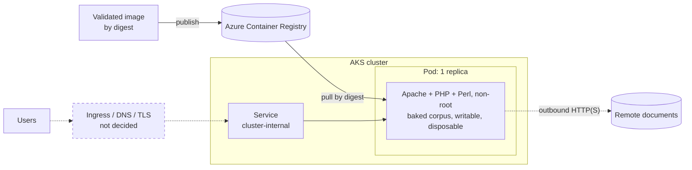
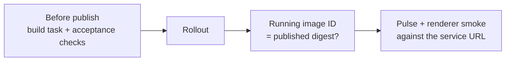

# Running on managed Kubernetes

- Status: draft
- Known facts only, from the local OrbStack deployment
- Decided: Azure AKS, images in Azure Container Registry (ACR); CI chosen with the first deploy
- Network and ingress details not decided; left out on purpose

## Target shape

- Solid = established locally
- Dashed = required, but not yet designed

## Carries over unchanged

- One Apache/PHP/Perl image, corpus baked in, referenced by digest (never a floating tag)
- Runtime security:
  - UID/GID 33, port 8080
  - no Linux capabilities, no privilege escalation
  - default seccomp profile, no service-account token
- Probes:
  - startup/readiness: PHP catalog page
  - liveness: TCP socket
  - prove PHP is serving, not parser correctness
- Resource requests/limits: local values as a starting point
- Cluster-internal Service in front of the Deployment

## Must change from local

- **Image source**
  - publish to ACR; reference as `<registry>.azurecr.io/<image>@sha256:<digest>`
  - drop the local-only "never pull" policy
- **Architecture**
  - build for the node architecture (`CMACC_PLATFORM`), or multi-arch
  - locked artifact is arm64; an amd64 build needs its own validation + digest
- **Repo links**
  - set `CMACC_REPO_URL` / `CMACC_REPO_BRANCH` per deployment, or leave unset to hide them
- **Access**
  - local = operator port-forward only
  - managed = deliberate exposure; nothing designed yet

## Legacy constraints

- **One replica only**
  - saves overwrite corpus files
  - remote includes share temp filenames
  - unsafe across replicas; races possible even with one
- **Edits disposable**
  - corpus writable in the container, no volume
  - Pod replacement restores baked content
  - persistence = a storage decision, not yet in scope
- **Save endpoints open**
  - source and JSON views write files
  - local safety relies on port-forward-only access
  - wider exposure must account for this
- **Outbound network**
  - remote includes need DNS + HTTP(S) from the Pod
  - remote content not pinned by the image
- **Errors return HTTP 200**
  - health checks and monitors must inspect bodies
  - reuse the pulse task's error markers

## Validation

- Before publish: build task (config test, checksums, digest vs lock) + acceptance checks
- After rollout: running Pod image ID matches the published digest (as local deploy does)
- Smoke: `CMACC_BASE_URL=<service URL> task pulse`; renderer smoke against the same base

## Not yet decided

- CI platform, and how it pushes to ACR
- Target node architecture
- Ingress, DNS, TLS
- Access control for save endpoints
- Storage for edits, if any
- Relationship to the existing DigitalOcean SSH deploy
