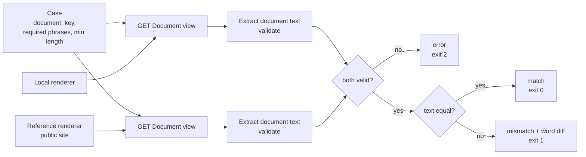
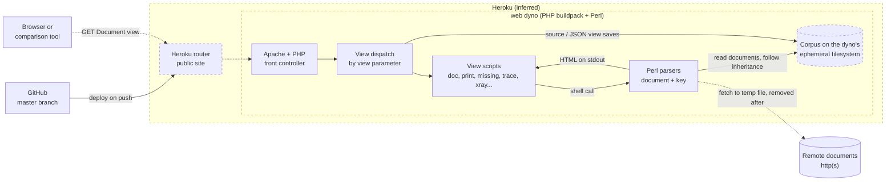
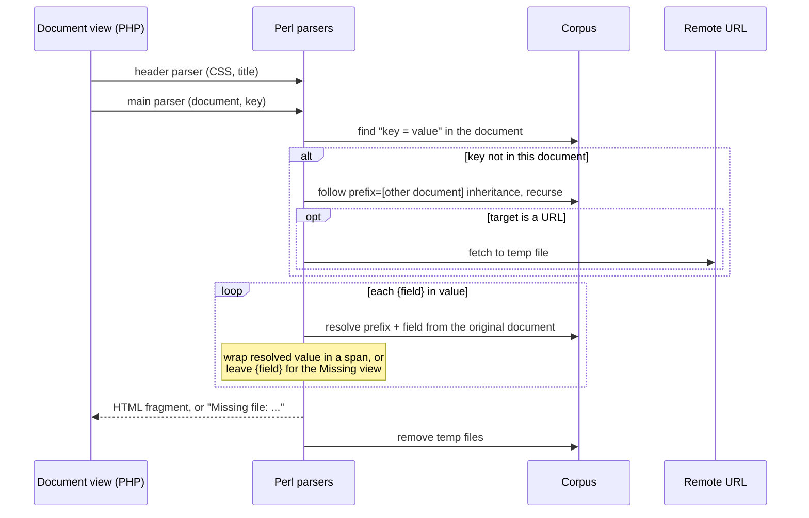

# Renderer comparison prototype

- Black-box: compares document text from two running renderers
- Does not implement or change the CommonAccord parser
- Prototype case: WorldCC NDA design form, Document view, key `r00t`

## How a comparison works



- **compare**: both sides; any unusable side is an error, never a pass
- **smoke**: local side only; `smoke_pass` never claims a reference match
- Evidence per run: raw HTML, normalized text, JSON report, word diff (when both valid)
- Report: URLs, retrieval times, content hashes, masked-date counts, unresolved fields

| Exit | Meaning |
|---|---|
| `0` | `match`, or local-only `smoke_pass` |
| `1` | both valid, normalized text differs |
| `2` | endpoint down, HTTP/decoding/renderer error, invalid document, bad config |

## Comparison contract

- Document text = everything after the Document view's navigation separator
- Excluded: navigation, head, scripts, styles, depth-control bar
- Kept: case, punctuation, amounts, dates, order, unresolved `{fields}`
- Normalized: HTML entities, whitespace
- Masked: only the renderer's own "on YYYY-MM-DD" metadata date; agreement dates kept
- Rejected even with HTTP 200:
  - missing navigation/separator
  - known renderer error text
  - too short, or missing required phrases
- Not measured: CSS layout, list numbering, JavaScript state, link targets
- Unfilled fields: reported and compared, not failures by themselves
- Mismatch ≠ parser regression; the corpus may differ too

## Reference discovery

- Organization homepage → document catalog on the public site
- Renders are live `i.php?v=d&f=<document>&k=<key>` requests, not exported files
- Search-indexed WorldCC NDA render identified the prototype document
- Leading slash in `f` redundant; the case uses the canonical path
- 2026-09-22: public site refused HTTP and HTTPS
  - case holds discovery provenance only, **no captured baseline**
  - search snippets and local output never used as reference
  - first successful live compare captures the real reference response

Links: [homepage](https://commonaccord.wordpress.com/) ·
[catalog](https://www.commonaccord.org/i.php?v=l&f=G/) ·
[WorldCC NDA render](https://www.commonaccord.org/i.php?f=%2FG%2FWorldCC%2FNDA-Design%2FForm%2F0.md&k=r00t&v=d)

## Reference deployment (inferred)

- No access to the public host; picture inferred from repository history
- Evidence for Heroku:
  - project README: "deployed via Heroku"
  - Heroku commits 2015 → 2025-04 (memory limits, "won't render", pruning)
  - no process or dependency manifest → fits PHP buildpack defaults (Apache, repo root)
- Later hosts in history: A2Hosting / cPanel (2025-10), DigitalOcean over SSH (2026-05)
- Any of these may serve the public site; comparison depends only on the HTTP interface
- Dashed = assumed, not observed



- Perl does all document assembly
- PHP: pick a view, call a parser with document + key, wrap its output in the page



- Parser errors come back inside HTTP 200 pages → contract rejects error text, not status codes

## Run with the pinned container

- Python + libraries pinned by image digest; no pip dependencies
- Legacy app image unchanged
- Needs OrbStack + the local app's port-forward
- Each run needs an empty output directory; new run name keeps old evidence
- Outputs go in the ignored agent-work area, never the corpus
- Base URLs: site roots (optionally a subdirectory), not `i.php` URLs
- From OrbStack, `host.docker.internal` reaches the macOS forward; a cluster Service URL also works

```bash
CMACC_TEST_IMAGE=python:3.14.7-slim-bookworm@sha256:82bc3c539b8813ada9d68c63b40158fa002f7f33de9bf3312a3dfdc0620dff56
mkdir -p .agent-work/renderer-smoke
docker --context orbstack run --rm \
  --mount "type=bind,src=$PWD,dst=/workspace,readonly" \
  --mount "type=bind,src=$PWD/.agent-work/renderer-smoke,dst=/results" \
  --workdir /workspace --env PYTHONDONTWRITEBYTECODE=1 \
  "$CMACC_TEST_IMAGE" python tools/renderer_compare.py compare \
  --local-base http://host.docker.internal:8080 \
  --reference-base https://www.commonaccord.org \
  --output /results/comparison-001
# local only: replace "compare" with "smoke", new output dir
# options: --case <json>  --timeout <seconds>
```

## Test the comparison tool

- Synthetic unit tests, offline:
  - markup normalization, meaningful amount changes
  - missing boundaries, HTTP-200 error pages, reference outages
  - metadata dates, placeholders, real-socket fetch
- Not evidence of equivalence with the public site
- Tool sends read-only GETs only: no edit routes, no forms, no snapshot updates, no Git

```bash
docker --context orbstack run --rm --network none \
  --mount "type=bind,src=$PWD,dst=/workspace,readonly" \
  --workdir /workspace --env PYTHONDONTWRITEBYTECODE=1 \
  "$CMACC_TEST_IMAGE" python -m unittest discover -s tests/renderer -v
```
